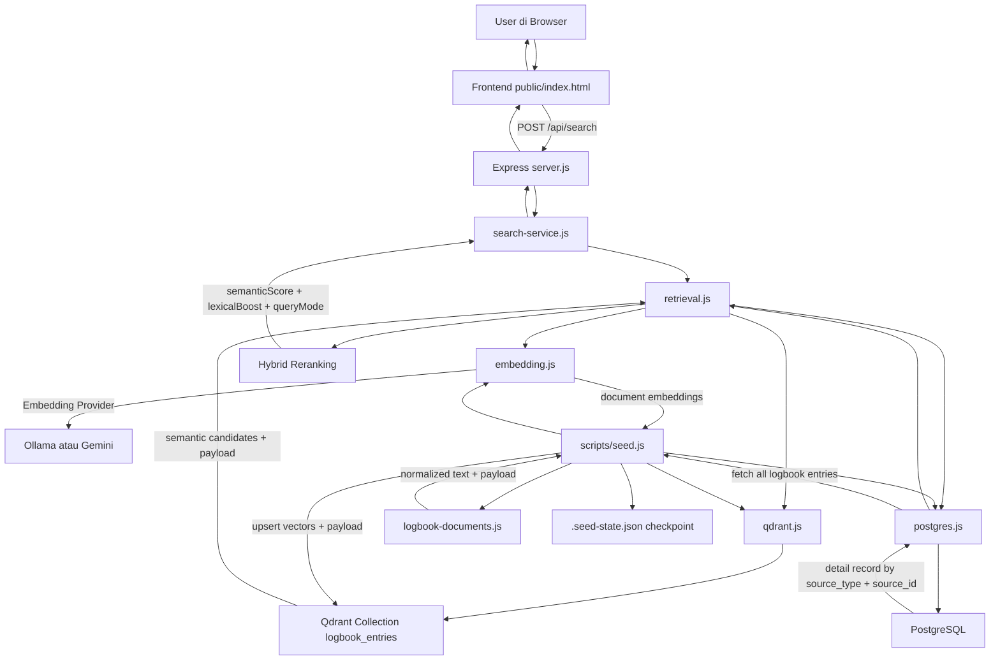

# Semantic Flow Diagram

```mermaid
flowchart TD
    A[User di Browser] --> B[Frontend public/index.html]

    B -->|POST /api/search| C[Express server.js]
    C --> D[search-service.js]
    D --> E[retrieval.js]

    E --> F[embedding.js]
    F -->|Embedding Provider| G[Ollama atau Gemini]

    E --> H[qdrant.js]
    H --> I[Qdrant Collection logbook_entries]
    I -->|semantic candidates + payload| E

    E --> J[postgres.js]
    J --> K[PostgreSQL]
    K -->|detail record by source_type + source_id| J
    J --> E

    E --> L[Hybrid Reranking]
    L -->|semanticScore + lexicalBoost + queryMode| D
    D --> C
    C --> B
    B --> A

    M[scripts/seed.js] --> J
    J -->|fetch all logbook entries| M
    M --> N[logbook-documents.js]
    N -->|normalized text + payload| M
    M --> F
    F -->|document embeddings| M
    M --> H
    M -->|upsert vectors + payload| I
    M --> O[.seed-state.json checkpoint]
```
